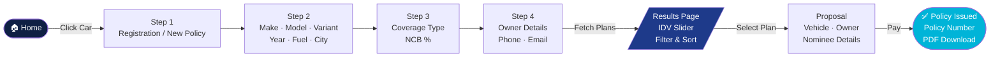
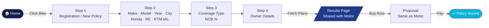
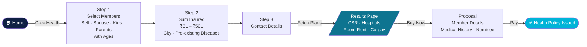
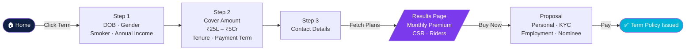
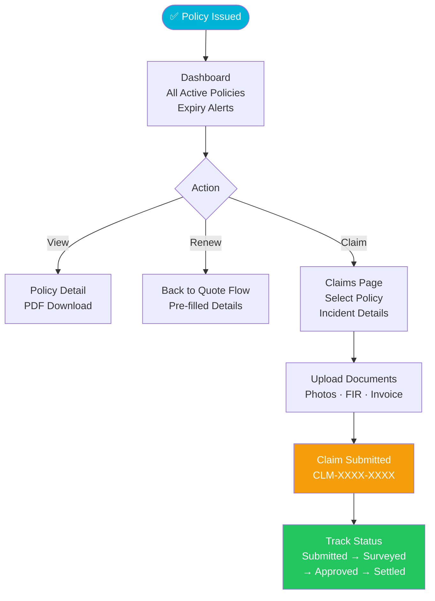

# InsureFlow

A full-stack insurance aggregator platform — compare, buy, and manage Car, Bike, Health, and Term insurance in one place.

---

## Tech Stack

| Layer | Technology |
|---|---|
| Frontend | React 18 + TypeScript + Vite 7 |
| Styling | Tailwind CSS v4 |
| State Management | Redux Toolkit (per-product slices) |
| Routing | React Router v6 |
| Backend | FastAPI (Python 3.10+) |
| API Validation | Pydantic v1 |
| Icons | Lucide React |

---

## Project Structure

```
insureflow/
├── api/                        # FastAPI backend
│   ├── main.py                 # App entrypoint, CORS config
│   ├── schemas.py              # Pydantic request/response models
│   ├── requirements.txt
│   └── routers/
│       ├── motor.py            # Quote pricing engine + vehicle lookup
│       ├── policies.py         # Policy list + detail
│       └── claims.py           # File claim + claim list
│
└── frontend/                   # React SPA
    └── src/
        ├── App.tsx             # Route definitions
        ├── index.css           # Tailwind v4 theme tokens
        ├── main.tsx
        ├── store/
        │   ├── index.ts        # Redux store (3 slices)
        │   ├── quoteSlice.ts   # Car + Bike state
        │   ├── healthSlice.ts  # Health insurance state
        │   └── termSlice.ts    # Term insurance state
        ├── types/index.ts      # Shared TypeScript types
        ├── data/mockData.ts    # Mock plans, policies, claims
        ├── utils/format.ts     # Currency formatter
        ├── components/
        │   └── layout/
        │       ├── Header.tsx
        │       └── Footer.tsx
        └── pages/
            ├── Home/           # Landing page
            ├── Motor/          # Car flow (QuoteFlow, Results, Proposal, Success)
            ├── Bike/           # Bike flow (QuoteFlow — reuses Motor Results/Proposal/Success)
            ├── Health/         # Health flow (QuoteFlow, Results, Proposal)
            ├── Term/           # Term flow (QuoteFlow, Results, Proposal)
            ├── Dashboard/      # Policy management + claims tab
            ├── Claims/         # File + track claims
            └── Docs/           # This flowchart page
```

---

## How to Run

### Frontend

```bash
cd frontend
# Requires Node 20+
nvm use 22
npm install
npm run dev      # http://localhost:5173
npm run build    # production build
```

### Backend

```bash
cd api
pip install -r requirements.txt
uvicorn main:app --reload    # http://localhost:8000
# API docs at http://localhost:8000/docs
```

---

## Product Flows

### Car Insurance



### Bike Insurance



### Health Insurance



### Term Life Insurance



### Post-Purchase: Dashboard & Claims



---

## API Endpoints

| Method | Endpoint | Description |
|---|---|---|
| `POST` | `/api/motor/quote` | Generate motor insurance plans with pricing |
| `GET` | `/api/motor/vehicle/{reg}` | Look up vehicle by registration number |
| `GET` | `/api/policies` | List all user policies |
| `GET` | `/api/policies/{id}` | Get single policy detail |
| `GET` | `/api/claims` | List all claims |
| `POST` | `/api/claims` | File a new claim |
| `GET` | `/api/claims/{id}` | Get single claim detail |
| `GET` | `/health` | API health check |

### Motor Quote Request/Response

```json
// POST /api/motor/quote
{
  "vehicle": { "make": "Maruti Suzuki", "model": "Swift", "year": 2022, "fuel_type": "Petrol", "city": "Mumbai" },
  "coverage_type": "comprehensive",
  "ncb_percent": 20,
  "idv": 650000
}

// Response
{
  "quote_id": "uuid",
  "idv_min": 455000,
  "idv_max": 845000,
  "plans": [
    {
      "id": "hdfc-ergo-a1b2c3",
      "insurer_name": "HDFC ERGO",
      "premium": 12450,
      "breakup": { "base_premium": 9200, "ncb_discount": 1150, "gst": 2600, "total": 12450 },
      "claim_settlement_ratio": 98.2,
      "cashless_garages": 6900
    }
  ]
}
```

---

## Redux State Architecture

```
Redux Store
├── quote (quoteSlice)          ← Car + Bike flows
│   ├── step: 1–4
│   ├── vehicle: { make, model, year, fuelType, city }
│   ├── config: { vehicleType, coverageType, ncbPercent, idv, addons }
│   ├── owner: { name, phone, email }
│   ├── plans: InsurancePlan[]
│   └── selectedPlanId: string | null
│
├── health (healthSlice)        ← Health flow
│   ├── step: 1–3
│   ├── members: { self, spouse, kids, father, mother }
│   ├── ages: { self, spouse, father, mother }
│   ├── sumInsured: number
│   ├── city: string
│   ├── preExisting: string[]
│   ├── plans: HealthPlan[]
│   └── selectedPlanId: string | null
│
└── term (termSlice)            ← Term flow
    ├── step: 1–3
    ├── dob, gender, smoker, annualIncome
    ├── coverAmount, tenure, paymentTerm
    ├── plans: TermPlan[]
    └── selectedPlanId: string | null
```

---

## Motor Pricing Engine

The backend pricing engine (`api/routers/motor.py`) computes real premiums:

```
IDV Depreciation  = base_value × (1 − min(0.5, age × 0.05))
Base Premium      = IDV × insurer_rate            (comprehensive)
                  = 2,100 flat                     (third party)
                  = IDV × insurer_rate × 0.7       (own damage)
NCB Discount      = Base × ncb_rate               (0–50%)
After NCB         = Base − NCB Discount
GST               = After NCB × 18%
Total             = After NCB + GST
```

---

## Routes Reference

| URL | Component | Description |
|---|---|---|
| `/` | `Home` | Landing page with product cards + quote widget |
| `/motor/quote` | `Motor/QuoteFlow` | Car insurance quote form (4 steps) |
| `/motor/results` | `Motor/Results` | Car plan comparison + IDV slider |
| `/motor/proposal` | `Motor/Proposal` | Car proposal form (4 steps) |
| `/motor/success` | `Motor/Success` | Policy confirmation |
| `/bike/quote` | `Bike/QuoteFlow` | Bike insurance quote form (4 steps) |
| `/bike/results` | `Motor/Results` | Shared results page (vehicleType=bike) |
| `/bike/proposal` | `Motor/Proposal` | Shared proposal page |
| `/bike/success` | `Motor/Success` | Shared success page |
| `/health/quote` | `Health/QuoteFlow` | Health quote form (3 steps) |
| `/health/results` | `Health/Results` | Health plan comparison |
| `/health/proposal` | `Health/Proposal` | Health proposal form (4 steps) |
| `/health/success` | `Motor/Success` | Shared success page |
| `/term/quote` | `Term/QuoteFlow` | Term quote form (3 steps) |
| `/term/results` | `Term/Results` | Term plan comparison |
| `/term/proposal` | `Term/Proposal` | Term proposal form (4 steps) |
| `/term/success` | `Motor/Success` | Shared success page |
| `/dashboard` | `Dashboard` | Policy list + claims tab |
| `/claims` | `Claims` | File + track claims |
| `/docs` | `Docs/FlowChart` | This documentation + flowcharts |
